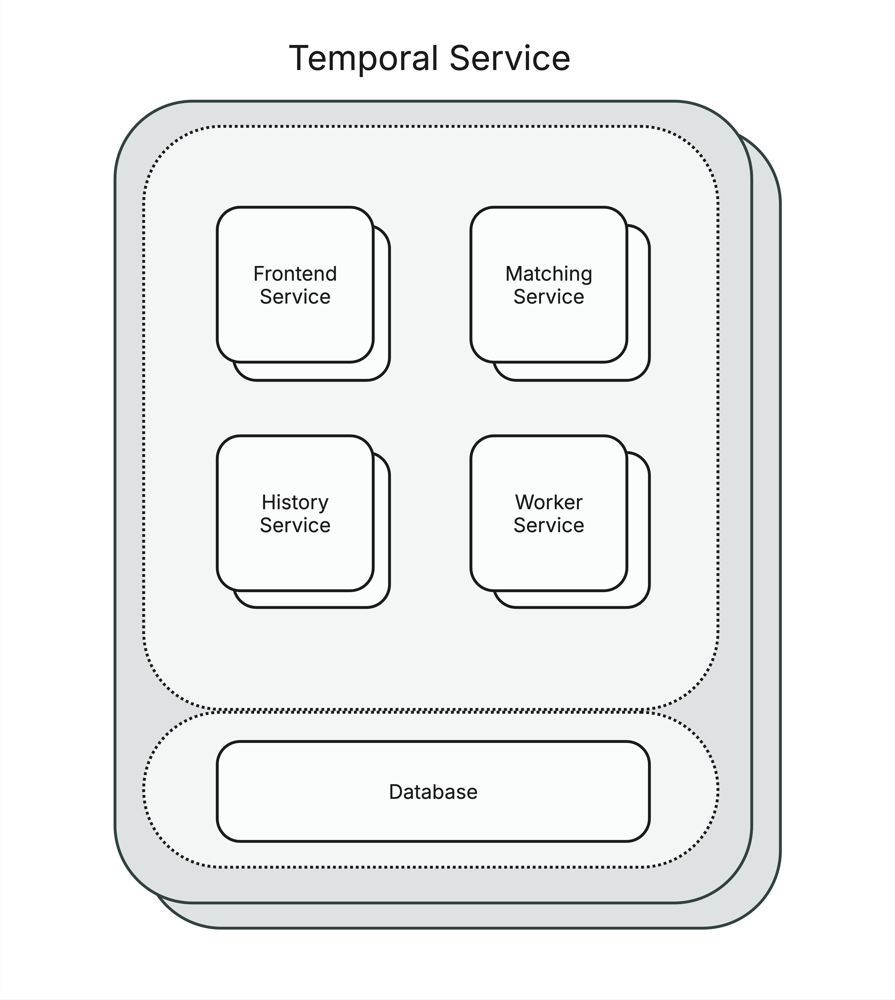
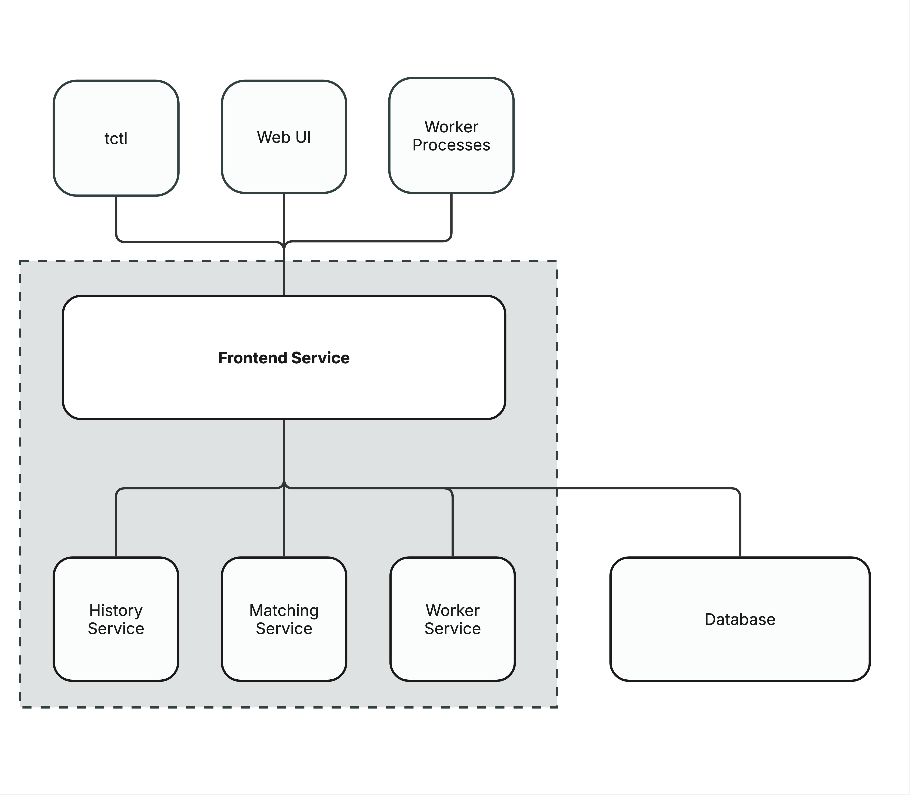
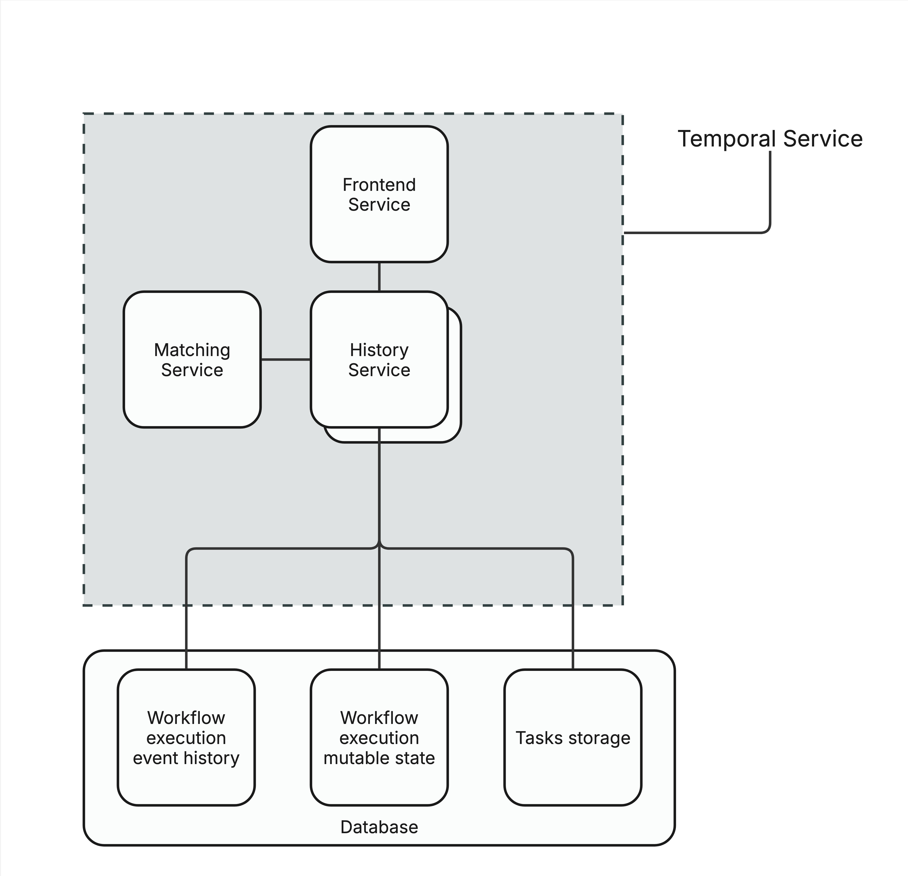
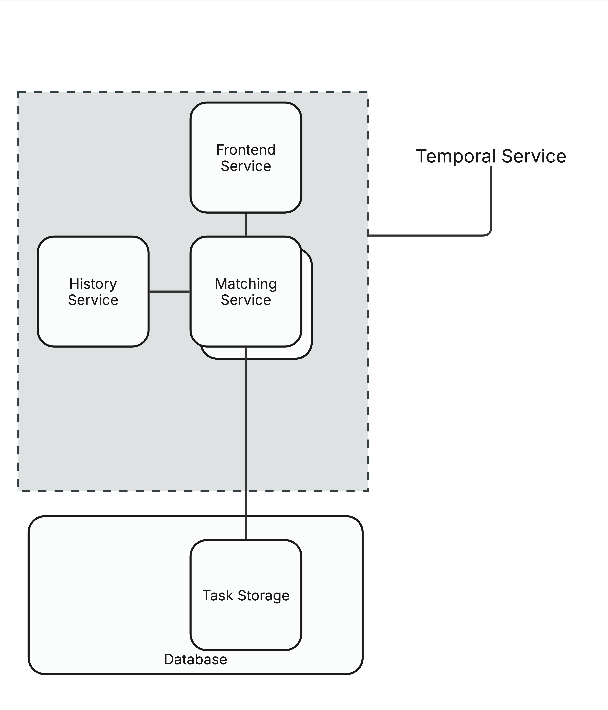
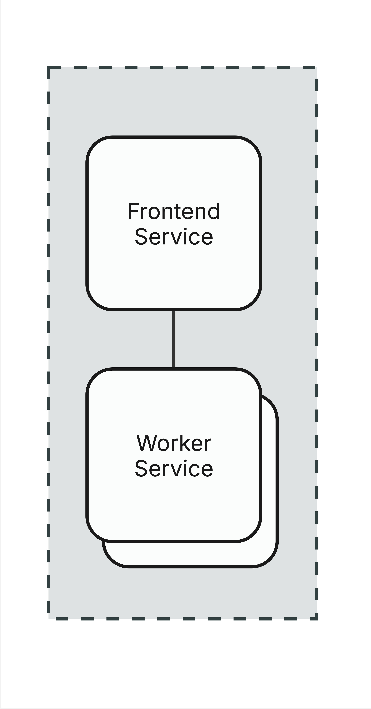
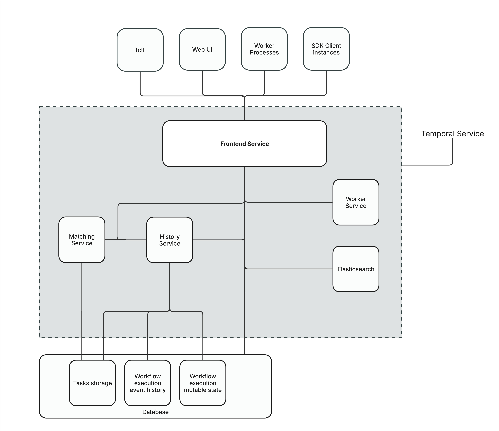

# Exercise 2.1: Exploring Temporal’s architecture and required services

The Temporal Server consists of 4 independently scalable services:
1. Frontend gateway which is used for rate limiting, routing and authorization. This is the entrypoint for users and workers (compute) to the Temporal service.
2. History subsystem which maintains data such as: state, queues and timers
3. Matching subsystem which manages the task queue for workers
4. Worker Service which manages internal background workflows.

In a live deployment of Temporal each of these services *should* be scaled to meet the needs of the system, for example a deployment with 2 frontend, 10 history, 12 matching and 2 workers is realistic and expected. 

## Scaling
The Temporal service can be deployed independently or in a single instance. Single instance deployments are useful for development but are not recommended in production environments as scaling needs are vastly different for each of the services. 

Each of the services can scale horizontally, but scaling history, matching or worker services requires a system restart due to how Temporal handles sharding. In contrast, frontend can scale without a system restart as it is stateless.

## Services
### Frontend

The frontend service is a stateless gateway service and acts as the entrypoint to the Temporal service. It is responsible for rate limiting, authorizing, validating and routing all inbound calls.

It uses the gRPC port 7233 to host the service handler and 6933 for membership-related communications by default. These ports are configurable within the Temporal service configuration.

### History

The History service manages workflow execution state persistence. It is responsible for updating the workflow history within the persistence layer and updates the task queue with the workflow state.

The total number of History Service processes is at minimum 1 and as high as the total number of History Shards. Each history service compute can support manay history shard with Temporal recommending a 1:500 ratio between history service and shard count.

It uses the gRPC port 7234 to host the service handler and 6934 for membership-related communications by default. These ports are configurable within the Temporal service configuration.

#### History Shards
The number of history shards represents the number of concurrent database operations that can occur for a Temporal service. The number of history shards in a Temporal service plays a significant role in the performance of a Temporal application. 

The number of history shards is set in the Temporal service configuration. Once set the shard count cannot be changed, therefor it is important to set, perform load simulation and determine the best configuration **before** attempting to make changes to production systems.

History shards are resposible for their own workflow execution event history, workflow execution mutable state and task queue.

### Matching

The matching service is responsible for matching workers to tasks and routing new tasks to the appropriate queue.

It uses the gRPC port 7235 to host the service handler and 6935 for membership-related communications by default. These ports are configurable within the Temporal service configuration.

### Worker

The worker service runs background processing for the replication queue and system workflows. 

It uses port  6939 for membership-related communications by default. This port is configurable within the Temporal service configuration.

## Exercise conclusion
You should now have a grasp on the fundamentals of the 4 services that make up the Temporal service. Two extremely important topics we discussed here is the independent scaling of services and history shards which will play a crucial role in fine-tuning the Temporal system.

Once you're ready move on to the next exercise where we will finally [deploy Temporal using Helm](./2.2.Deploying-Temporal-server-components-using-a-Helm-chart.md).

